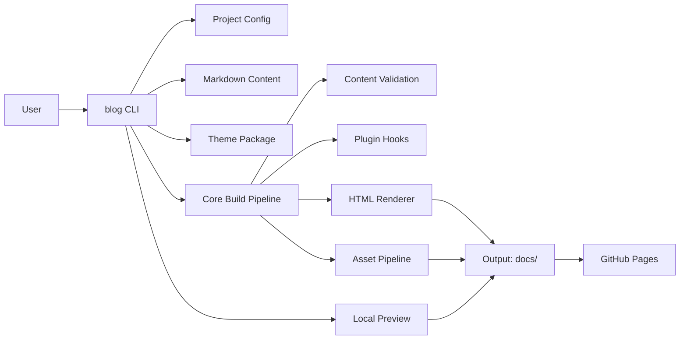

# RFC: Swift Static Blog + CLI Platform

## Metadata
- **Status**: Draft
- **Author**: Kris + OpenCode
- **Created**: 2026-03-05
- **Target Version**: v1.0 (MVP + themes/plugins)
- **Reviewers**: [TODO: add reviewers]
- **Related Docs**: [TODO: link roadmap or personal requirements]

## Change Log
| Date | Author | Change |
| --- | --- | --- |
| 2026-03-05 | OpenCode | Initial RFC draft |
| 2026-03-05 | OpenCode | Scoped search to post-v1; added GFM + code highlighting requirements |

## Why
The blog should support fast personal publishing with a durable, local-first workflow and no runtime server dependency. Posts should be plain Markdown files kept in git, while a dedicated Swift CLI provides repeatable commands for creating content, building the site, and validating output.

This project should prioritize long-term maintainability and quality over short-term speed, including testing, clean architecture, extensibility for themes/plugins, and opinionated defaults that make writing and publishing easy.

## Goals
1. Build a static site generator (SSG) in Swift that compiles Markdown posts into a deployable static site.
2. Build a first-party Swift CLI for content and site lifecycle management.
3. Keep content storage human-readable and git-friendly (`.md` + front matter).
4. Support broad topic coverage (work, personal, technical, notes) via flexible metadata and taxonomy.
5. Include extensibility primitives in v1 for themes and plugins.
6. Produce output optimized for GitHub Pages deployment.
7. Encode best practices for frontend structure and composition so generated sites remain high quality.
8. Support GitHub Flavored Markdown (GFM), including tables, task lists, strikethrough, and fenced code blocks.
9. Support syntax-highlighted code blocks in generated HTML.

## Non-Goals
- No server-rendered runtime or backend API in v1.
- No CMS UI in v1.
- No multi-author editorial workflow in v1.
- No hosted SaaS control plane.
- No built-in site search in v1 (defer to v1.1+).

## What (Short)
Ship a Swift package containing:
- `blog` CLI binary
- Core SSG engine
- Theme system
- Plugin system
- Markdown-based content model

The CLI manages post creation, linting/validation, local preview, and static build output. Generated output is plain HTML/CSS/JS assets deployable to GitHub Pages.

## Options Considered

### Option A (Recommended): Monorepo Swift package with modular architecture
Single Swift package with clear internal modules (`Core`, `CLI`, `Renderer`, `Themes`, `Plugins`, `Preview`) and one binary target.

**Pros**
- Strong cohesion and type sharing across CLI + engine.
- Easier testing and release management for a single product.
- Good path to plugin protocol stability.

**Cons**
- Requires careful boundaries to avoid module coupling.

### Option B: Split repos (CLI repo + generator repo)
Separate repos and release cycles for CLI and SSG engine.

**Pros**
- Independent lifecycle for engine and CLI.

**Cons**
- Higher maintenance overhead.
- More complexity for cross-repo changes and version compatibility.

### Option C: Generator-first, add CLI later
Start as a library-only SSG, then add CLI wrapper post-MVP.

**Pros**
- Faster initial engine iteration.

**Cons**
- Delays UX and workflow automation.
- Risks API drift between library and eventual CLI.

## Recommended Approach
Adopt **Option A**. It balances developer ergonomics, product cohesion, and long-term maintainability while keeping architecture explicit enough to avoid monolith drift.

## User Stories
1. As a writer, I run `blog post new` and get a ready-to-edit Markdown file with front matter defaults.
2. As a publisher, I run `blog build` and receive a fully static site bundle.
3. As a maintainer, I run `blog check` and catch schema, link, and content errors before deploy.
4. As a designer/developer, I create a theme package and switch themes without changing content files.
5. As an advanced user, I install plugins to add transforms, shortcodes, or build hooks.

## Architecture

### High-Level Components
- **CLI Layer**: Command parsing, UX output, project scaffolding, command orchestration.
- **Content Layer**: GFM Markdown parsing, front matter decoding, schema validation.
- **Core Build Pipeline**: Content indexing, routing, template rendering, asset copying.
- **Theme Engine**: Theme manifests, templates, style tokens, layouts, partials.
- **Plugin Runtime**: Hook execution around parse/build/render stages.
- **Preview Layer**: Local static preview experience (no production server dependency).

### Architecture Diagram


## Content Model

### File Layout (Proposed)
```text
content/
  posts/
    2026-03-05-my-post.md
themes/
  default/
plugins/
  [plugin-name]/
public/
  [static-assets]
blog.config.json
```

### Front Matter Schema (v1)
Required:
- `title: String`
- `date: ISO8601 Date`
- `slug: String`

Optional:
- `summary: String`
- `tags: [String]`
- `categories: [String]`
- `draft: Bool`
- `series: String`
- `canonicalUrl: String`
- `coverImage: String`

## CLI Design

### Command Surface (v1)
- `blog init` - bootstrap a new site.
- `blog post new <title>` - create post stub with front matter and slug.
- `blog post list` - list posts and draft status.
- `blog build` - generate static site.
- `blog serve` - local preview against generated output.
- `blog check` - validate metadata, links, content constraints.
- `blog check` - validate metadata, links, content constraints, and unsupported markdown constructs.
- `blog theme list|use` - inspect/select theme.
- `blog plugin list|enable|disable` - manage plugin activation.

### CLI UX Best Practices
- Deterministic command behavior with explicit exit codes.
- Machine-readable mode (`--json`) for scriptability.
- Friendly human output by default.
- Dry-run support for mutating commands where possible.

## Theme System

### Theme Contract
Each theme defines:
- Manifest (`theme.json`) with metadata and compatibility range.
- Layout templates (home, post, archive, tag index).
- Token file for color/spacing/typography primitives.
- Static assets (CSS, JS, images, fonts).

### Best-Practice Frontend Guardrails
To align with requested frontend quality standards, theme guidance should encode:
- Deliberate typography scale and non-default font strategy.
- Cohesive visual direction (tokens, spacing rhythm, color system).
- Responsive-first templates for mobile and desktop parity.
- Composition-friendly component structure over prop-heavy ad hoc templates.
- Accessibility checks as part of build validation.

## Plugin System

### Plugin Hooks (Initial)
- `beforeParse(contentPath)`
- `afterParse(contentDocument)`
- `beforeRender(routeContext)`
- `afterRender(outputPath)`
- `onBuildComplete(buildReport)`

### Safety Model
- Versioned plugin API.
- Capability declaration in plugin manifest.
- Clear failure boundaries (plugin error handling policy).
- [TODO: finalize plugin trust model for third-party code execution]

## Build and Output
- Output directory defaults to `docs/` for GitHub Pages compatibility.
- Build should fingerprint static assets for cache safety.
- Markdown engine must implement GFM semantics consistently for local preview and production builds.
- Code fences should render with syntax-highlighted HTML classes/styles via a deterministic highlighter.
- Route generation should support:
  - Home
  - Post detail
  - Tag/category index
  - Archive
  - RSS feed (optional but recommended for v1)

## Testing Strategy

### Unit Tests
- Front matter parsing/validation.
- GFM feature coverage (tables, task lists, autolinks, strikethrough).
- Slug/date normalization.
- Template rendering helpers.
- Code fence parsing and language mapping for highlighter output.
- CLI command argument parsing.

### Integration Tests
- End-to-end `init -> post new -> build` workflow.
- Theme switching behavior.
- Plugin hook execution order.
- Golden-file tests for markdown-to-HTML output with highlighted code blocks.
- Deterministic output snapshot tests.

### Quality Gates
- `swift test` required on CI.
- Lint and format checks for Swift code.
- Fixture-based regression tests for known content edge cases.

## Release Plan

### Milestones
1. **M1 Core Engine (1-2 eng-weeks)**
   - Markdown parse + front matter schema + route mapping.
2. **M2 CLI MVP (1-2 eng-weeks)**
   - `init`, `post new`, `build`, `serve`, `check`.
3. **M3 Themes + Plugins (2-3 eng-weeks)**
   - Theme manifest and baseline plugin hooks.
4. **M4 Hardening + Docs (1 eng-week)**
   - Test coverage, starter templates, usage docs.

### Rollout
- Ship as v0.x pre-1.0 for early iteration.
- Validate against real personal content corpus.
- Promote to v1.0 after plugin/theme API stabilization.

### Rollback
- Preserve previous release binaries.
- Provide content compatibility versioning and migration notes.
- Avoid destructive in-place content rewrites by default.

## Security Considerations
- Treat plugin execution as untrusted by default.
- Avoid shell command execution in core pipeline unless explicitly configured.
- Validate/escape rendered content to prevent malformed HTML output.
- Prevent path traversal when resolving content/assets.
- [TODO: decide signed plugin distribution vs local-only plugins for v1]

## Risks and Mitigations
- **Risk**: Plugin API churn creates ecosystem instability.
  - **Mitigation**: Versioned APIs, deprecation window, compatibility tests.
- **Risk**: Theme flexibility causes inconsistent site quality.
  - **Mitigation**: Provide strong default theme and validation checklist.
- **Risk**: Scope creep in v1.
  - **Mitigation**: Keep strict MVP boundary; defer advanced capabilities.

## Open Questions
1. Should theme templates be Swift-native templating, a JS runtime, or a minimal custom DSL?
2. What plugin packaging/distribution mechanism is needed beyond local plugins?
3. Should `blog serve` include hot reload in v1 or stay minimal?

## Success Metrics
- Time from new idea to published post under 10 minutes for standard flow.
- `blog check` catches metadata/link errors before deploy in >95% of sampled failures.
- Build determinism: same input yields byte-stable output (except timestamps where unavoidable).
- New theme integration completed without core changes.

## Appendix: Best Practices Mapping (Requested)
During implementation, apply the following standards explicitly:
- Frontend design quality conventions for typography, visual identity, responsive behavior.
- Composition-driven component architecture patterns to avoid rigid templates.
- React-specific performance and composition guidance only where React is actually introduced (for example, optional interactive islands).
- Web UI review checks for accessibility and interaction quality.

[Assumption: Site output remains mostly static HTML/CSS with optional client-side islands only when justified.]
